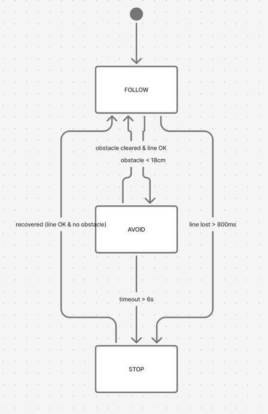
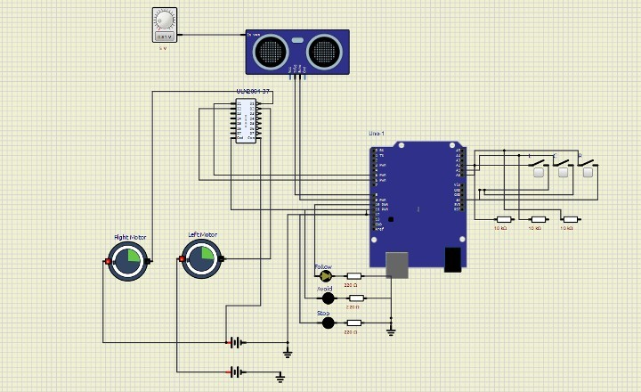
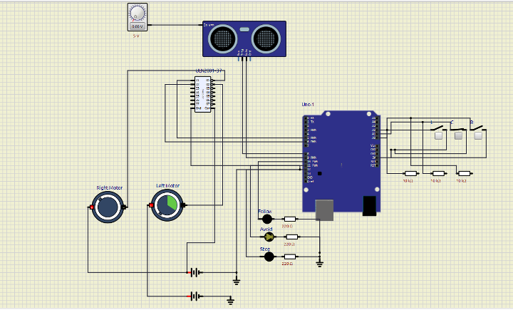
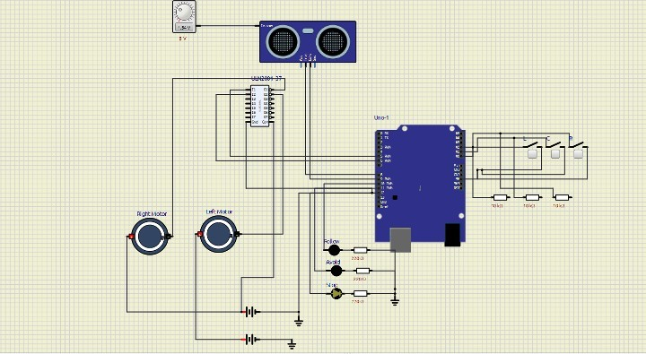

# FSM-Based Line Following and Obstacle Avoiding Robot

## Overview

This project presents the design and simulation of an Autonomous Line Following and Obstacle Avoiding Robot using an Arduino Uno (ATmega328P) in SimulIDE.

The robot is capable of:

- Following a predefined line path
- Detecting obstacles using an ultrasonic sensor
- Avoiding obstacles through a predefined maneuver sequence
- Stopping safely when the line is lost or obstacles persist
- Demonstrating Finite State Machine (FSM) based control
- Demonstrating concurrent task scheduling and timing coordination

---

## Features

- Line Following using three simulated IR sensors
- Obstacle Detection using HC-SR04 Ultrasonic Sensor
- Obstacle Avoidance using FSM-based behavior control
- Stop Mode for safety conditions
- Proportional Control (P-Control)
- Concurrent Task Scheduling using `millis()`
- Real-Time LED State Indication
- SimulIDE Circuit Simulation

---

## Components Used

| Component | Purpose |
|-----------|----------|
| Arduino Uno (ATmega328P) | Main Controller |
| HC-SR04 Ultrasonic Sensor | Obstacle Detection |
| ULN2001 Driver Array | Motor Driver |
| 2 DC Motors | Robot Movement |
| 3 Simulated IR Sensors (Switches) | Line Detection |
| Potentiometer | Simulated Distance Control |
| LEDs | State Indicators |
| SimulIDE | Simulation Platform |

---

## Finite State Machine (FSM)

The robot operates using three primary states:

### Follow Mode

- Continuously follows the line
- Uses line sensor feedback
- Applies proportional control for steering correction

### Avoid Mode

- Activated when an obstacle is detected
- Executes a predefined avoidance sequence
- Returns to Follow Mode when safe

### Stop Mode

- Activated when:
  - The line is lost
  - An obstacle persists beyond timeout
- Motors are stopped until recovery conditions are met

---

## FSM Diagram



---

## Circuit Design and Follow Mode

The image below shows the complete SimulIDE circuit while operating in Follow Mode.



### Main Connections

#### Line Sensors

- Left Sensor → A0
- Center Sensor → A1
- Right Sensor → A2

#### Ultrasonic Sensor

- TRIG → D8
- ECHO → D9

#### Motor Driver

- Left Motor → D5
- Right Motor → D6

#### State LEDs

- Follow LED → D10
- Avoid LED → D11
- Stop LED → D12

---

## Avoid Mode Demonstration

When the ultrasonic sensor detects an obstacle closer than the configured threshold distance, the robot transitions from **Follow Mode** to **Avoid Mode**.

The robot executes a timed avoidance maneuver:

1. Stop
2. Turn Right
3. Move Forward
4. Turn Left
5. Continue Forward
6. Return to Follow Mode



---

## Stop Mode Demonstration

The robot enters Stop Mode when:

- The line is lost for longer than the timeout period
- An obstacle persists beyond the avoidance timeout

In this state:

- Motors stop immediately
- Stop LED turns ON
- The robot waits for recovery conditions



---

## FSM Transition Table

| Current State | Condition | Next State |
|---------------|------------|------------|
| Follow | Obstacle Detected | Avoid |
| Follow | Line Lost Timeout | Stop |
| Avoid | Obstacle Cleared and Line Visible | Follow |
| Avoid | Avoidance Timeout | Stop |
| Stop | Line Visible and Obstacle Cleared | Follow |

---

## Concurrent Task Scheduling

The project uses a cooperative multitasking approach based on the Arduino `millis()` function.

| Task | Interval |
|------|----------|
| Line Sensor Reading | 10 ms |
| Ultrasonic Sensor Reading | 60 ms |
| FSM Update | 10 ms |
| Motor Control | 10 ms |
| Debug Output | 500 ms |

---

## Proportional Control

```cpp
correction = Kp * error;

leftMotorSpeed  = BASE_SPEED - correction;
rightMotorSpeed = BASE_SPEED + correction;

Where:

- `error` = deviation from the line
- `Kp` = proportional gain
- `correction` = steering adjustment

---

## Testing and Validation

### Test 1 – Normal Line Following

- Center sensor active
- No obstacle present
- Robot moves forward

### Test 2 – Left Deviation

- Left sensor active
- Robot corrects toward the line

### Test 3 – Right Deviation

- Right sensor active
- Robot corrects toward the line

### Test 4 – Obstacle Detection

- Distance below threshold
- Robot enters Avoid Mode

### Test 5 – Persistent Obstacle

- Obstacle remains beyond timeout
- Robot enters Stop Mode

### Test 6 – Line Loss

- All sensors inactive
- Robot enters Stop Mode

---

## Project Structure

```text
FSM-Based-Line-Following-and-Obstacle-Avoiding-Robot/
│
├── README.md
├── .gitignore
│
├── code/
│   └── line_follower_robot.ino
│
├── simulation/
│   └── backup.sim1
│
├── images/
│   ├── follow_mode.png
│   ├── avoid_mode.png
│   ├── stop_mode.png
│   └── fsm_diagram.png
│
└── docs/
    └── Project_Report.pdf
```

---

## How to Run

1. Open SimulIDE.
2. Open `backup.sim1`.
3. Load the Arduino firmware from `line_follower_robot.ino`.
4. Start the simulation.
5. Use the line sensor switches to simulate line detection.
6. Use the potentiometer connected to the HC-SR04 distance input to simulate obstacles.
7. Observe state transitions through LEDs and motor behavior.

---

## Skills Demonstrated

- Embedded Systems
- Arduino Programming
- Robotics
- Finite State Machine Design
- Concurrent Task Scheduling
- Real-Time Systems
- Sensor Integration
- Motor Control
- SimulIDE Circuit Design
- Debugging and Validation

---

## Author

**Nitin Mereddy**

Master of Applied Computer Science  
St. Francis Xavier University  
Nova Scotia, Canada
